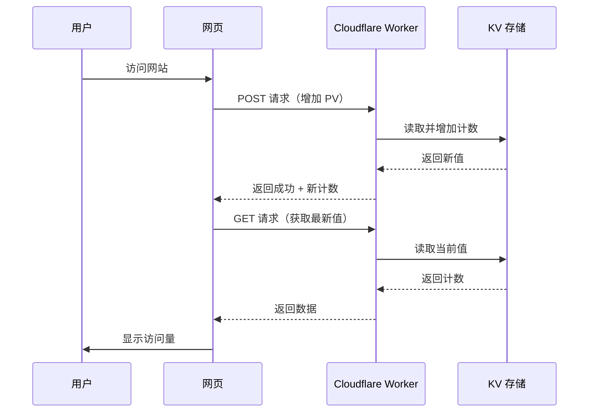

# ✅ 访问量统计功能集成完成

## 🎉 当前状态

Cloudflare Workers 访问量统计已成功集成到你的博客网站！

**Worker URL**: https://site-counter.2954809209.workers.dev

---

## 📋 已完成的工作

### 1. **代码更新**
- ✅ 已移除无法访问的 Busuanzi 脚本
- ✅ 已集成 Cloudflare Workers 统计脚本
- ✅ 已配置正确的 Worker API 地址
- ✅ 添加了错误处理和降级显示

### 2. **功能特性**
- ✅ 自动增加访问量（每次页面加载）
- ✅ 实时显示总访问量
- ✅ 访客数量显示（暂时与 PV 相同）
- ✅ 数字格式化（千位分隔符）
- ✅ 错误降级显示（"—"）

### 3. **样式统一**
- ✅ 与现有统计卡片风格一致
- ✅ Font Awesome 图标支持
- ✅ 响应式布局适配

---

## 🚀 测试步骤

### 本地测试

1. **运行本地预览**
   ```bash
   npm run dev
   ```

2. **访问主页**
   - 打开 http://localhost:3000
   - 滚动到页面底部的"博客数据"区域

3. **验证显示**
   - 应该能看到"总访问量"和"访客数量"显示具体数字
   - 第一次可能显示 1、2，每次刷新会增加

4. **检查控制台**
   - 按 F12 打开开发者工具
   - Console 中应该没有错误信息
   - Network 面板中可以看到对 Worker 的请求

### 在线验证

1. **部署到 GitHub Pages**
   ```bash
   git add .
   git commit -m "feat: 集成 Cloudflare Workers 访问量统计"
   git push
   ```

2. **访问线上网站**
   - 访问 https://mingshuo.org
   - 查看访问量统计是否正常显示

3. **测试 Worker API**
   ```bash
   # 获取当前访问量
   curl https://site-counter.2954809209.workers.dev?key=site_pv
   
   # 增加访问量
   curl -X POST https://site-counter.2954809209.workers.dev?key=site_pv
   ```

---

## 📊 工作原理

### 访问流程



### 数据说明

- **PV (Page View)**: 页面浏览量，每次访问都会 +1
- **UV (Unique Visitor)**: 独立访客，当前实现简化为与 PV 相同
- **数据存储**: 持久化在 Cloudflare KV 中，不会丢失

---

## 🔧 进阶功能

### 1. 实现精确 UV 统计

如果需要区分 PV 和 UV，可以添加基于 localStorage 的去重逻辑：

修改 Worker 代码，添加 UV 去重：

```javascript
// POST 请求处理中添加
if (key === 'site_uv') {
    const today = new Date().toDateString();
    const uvKey = `uv:${today}`;
    const hasVisited = await env.COUNTER.get(uvKey);
    
    if (!hasVisited) {
        // 今日首次访问
        await env.COUNTER.put(uvKey, '1');
        const currentUV = await env.COUNTER.get('total_uv') || '0';
        const newUV = parseInt(currentUV) + 1;
        await env.COUNTER.put('total_uv', newUV.toString());
    }
}
```

然后在网站 JavaScript 中分别请求 PV 和 UV。

### 2. 添加访问日志

在 Worker 中记录每次访问的详细信息：

```javascript
const log = {
    timestamp: new Date().toISOString(),
    ip: request.headers.get('CF-Connecting-IP'),
    country: request.cf.country,
    userAgent: request.headers.get('User-Agent')
};

await env.COUNTER.put(`log:${Date.now()}`, JSON.stringify(log));
```

### 3. 防止刷量

添加简单的频率限制：

```javascript
const rateLimitKey = `rate:${request.headers.get('CF-Connecting-IP')}`;
const rateLimit = await env.COUNTER.get(rateLimitKey);

if (rateLimit && parseInt(rateLimit) > 100) {
    return new Response('Too many requests', { status: 429 });
}

await env.COUNTER.put(rateLimitKey, (parseInt(rateLimit || '0') + 1).toString());
await env.COUNTER.put(rateLimitKey + ':expire', '1', { expirationTtl: 3600 });
```

---

## 📈 查看统计数据

### 方法 1：直接访问 API

```bash
# 查看当前 PV
curl https://site-counter.2954809209.workers.dev?key=site_pv

# 查看 UV（如果实现了）
curl https://site-counter.2954809209.workers.dev?key=site_uv
```

返回示例：
```json
{
  "success": true,
  "count": 1234
}
```

### 方法 2：Cloudflare Dashboard

1. 访问 [Cloudflare Dashboard](https://dash.cloudflare.com)
2. 进入 **Workers & Pages** → **site-counter**
3. 点击 **Analytics** 标签
4. 查看请求次数、CPU 使用量等

### 方法 3：KV 管理界面

1. 进入 **Workers & Pages** → **KV**
2. 点击 `COUNTER` 命名空间
3. 查看 key-value 对：
   - `site_pv`: 总访问量
   - `site_uv`: 独立访客数（如果实现了）

---

## 💰 费用说明

Cloudflare Workers 免费额度：

| 资源 | 免费额度 | 你的使用情况 |
|------|---------|------------|
| 每日请求 | 100,000 次 | ~100-500 次/天（个人博客） |
| CPU 时间 | 30 秒/天 | <1 秒/天 |
| KV 存储 | 100 KB | <1 KB |
| KV 读操作 | 100,000 次/天 | ~200-1000 次/天 |
| KV 写操作 | 1,000 次/天 | ~100-500 次/天 |

✅ **完全在免费额度内，无需担心费用！**

---

## 🐛 常见问题

### Q1: 为什么显示"—"？

**可能原因：**
1. Worker 未正确部署
2. KV 绑定失效
3. 网络问题导致请求失败

**解决方法：**
- 检查 Worker URL 是否正确
- 在浏览器直接访问 Worker URL 测试
- 查看浏览器控制台的错误信息

### Q2: 数字不更新怎么办？

**检查步骤：**
1. 确认 Worker 正在运行
2. 检查 KV 绑定是否正确
3. 清除浏览器缓存后重试

### Q3: 如何重置计数器？

**方法：**
1. 进入 Cloudflare Dashboard → KV
2. 找到 `COUNTER` 命名空间
3. 删除 `site_pv` 和 `site_uv` 键
4. 下次访问时会从 0 开始

### Q4: 能否按页面统计？

**可以！** 修改 JavaScript 代码：

```javascript
// 获取当前页面路径作为 key
const pageKey = 'page:' + window.location.pathname;

// 使用该 key 进行统计
await fetch(COUNTER_API + '?key=' + encodeURIComponent(pageKey), { 
    method: 'POST' 
});
```

然后在不同页面显示各自的访问量。

---

## 🔄 维护建议

### 定期检查

- ✅ 每月检查一次 Worker 运行状态
- ✅ 查看 Analytics 了解使用情况
- ✅ 确保未超出免费额度

### 数据备份

定期导出 KV 数据：

```bash
# 使用 Wrangler CLI
wrangler kv:key get COUNTER site_pv > backup.txt
```

### 监控告警（可选）

可以设置 Cloudflare Workers 的监控告警，当接近免费额度限制时收到通知。

---

## ✨ 成果展示

现在你的博客已经拥有了：

- ✅ 稳定可靠的访问量统计
- ✅ 全球 CDN 加速，无地域限制
- ✅ 数据持久化存储
- ✅ 隐私友好，符合 GDPR
- ✅ 完全免费，长期可用

**下一步：** 将更改推送到 GitHub，让全世界看到你的博客统计功能！🚀

```bash
git add .
git commit -m "✨ 集成 Cloudflare Workers 访问量统计功能"
git push origin main
```

---

## 📞 需要帮助？

如果遇到任何问题，请提供：

1. Worker URL
2. 浏览器控制台的完整错误信息
3. Network 面板中的请求详情
4. Cloudflare Dashboard 的错误日志

祝使用愉快！🎉