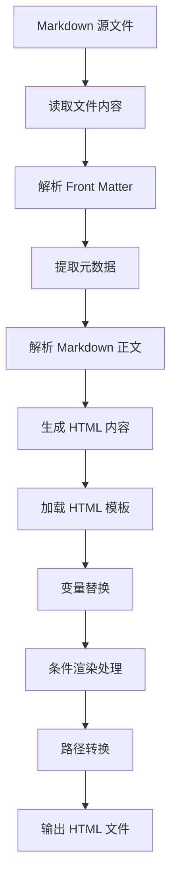

# 📝 博客文章撰写指南

本指南将帮助你正确地撰写和格式化博客文章，确保文章能够被正确地转换为 HTML 并发布到网站上。

## 一、文件存放位置

所有文章的 Markdown 源文件都存放在：
```
src/data/articles/
```

只需将写好的 [.md](file://c:\Users\29548\Desktop\Sunshine\Mycode\github\MingShuo-S.github.io\README.md) 文件放在这个目录下即可。

---

## 二、文件命名规范

### 推荐格式
```
YYYY-MM-DD-slug.md
```

**示例：**
```
2025-01-28-building-personal-blog.md
2025-02-01-javascript-async-await-guide.md
2025-03-15-react-hooks-best-practices.md
```

### 命名规则说明

1. **日期部分**：`YYYY-MM-DD` 格式，表示文章发布日期
2. **Slug 部分**：文章的英文标识符，使用小写字母和连字符（`-`）
   - 单词之间用 `-` 连接
   - 只包含小写字母、数字和连字符
   - 避免使用中文、空格或特殊符号

### Slug 生成逻辑

系统会根据以下规则自动生成文章的 URL 路径：

- **中文标题**：使用文件名中的 slug 部分（移除日期前缀）
  ```
  文件名：2025-01-28-building-personal-blog.md
  标题："从零搭建静态博客"
  → URL: /posts/building-personal-blog/
  ```

- **英文标题**：可直接从标题生成
  ```
  文件名：2025-02-01-guide.md
  标题："Building Personal Blog From Scratch"
  → URL: /posts/building-personal-blog-from-scratch/
  ```

---

## 三、Front Matter（元数据）

每篇文章的开头必须包含 Front Matter，用于定义文章的元数据。Front Matter 位于文件的最顶部，以 `---` 开始和结束。

### 完整格式示例

```markdown
---
title: "从零搭建静态博客：现代前端工程化实践与思考"
date: 2025-01-28
tags: ["前端工程", "静态站点", "JavaScript", "Node.js", "博客搭建"]
category: "技术实践"
summary: "记录从零开始搭建个人静态博客的技术选型、架构设计和工程化思考，包含模块化、构建系统和部署策略的完整实践。"
read_time: 12
difficulty: "进阶"
cover_image: "/assets/images/blog-cover.jpg"
bibliography: ["Node.js 官方文档", "MDN Web Docs", "Static Site Generators Comparison"]
---
```

### 字段详解

#### ✅ 必填字段

| 字段 | 类型 | 说明 | 示例 |
|------|------|------|------|
| `title` | String | 文章标题 | `"从零搭建静态博客"` |
| `date` | Date | 发布日期（YYYY-MM-DD） | `2025-01-28` |

#### 🔹 可选字段

| 字段 | 类型 | 说明 | 默认值 | 示例 |
|------|------|------|--------|------|
| `tags` | Array | 标签数组（用于分类和搜索） | 无 | `["前端", "Node.js"]` |
| `category` | String | 文章分类 | "未分类" | `"技术实践"` |
| `summary` | String | 文章摘要（用于首页展示和 SEO） | 无 | `"记录技术思考..."` |
| `read_time` | Number | 阅读时长（分钟） | 自动计算 | `12` |
| `difficulty` | String | 难度等级 | "中等" | `"入门"`, `"基础"`, `"进阶"`, `"高级"` |
| `cover_image` | String | 封面图片路径 | 无 | `"/assets/images/cover.jpg"` |
| `bibliography` | Array | 参考文献列表 | 无 | `["文献 1", "文献 2"]` |

### 字段注意事项

1. **title（标题）**
   - 必须使用双引号包裹
   - 支持中文和英文
   - 建议简洁明了，不超过 50 个字符

2. **date（日期）**
   - 严格遵循 `YYYY-MM-DD` 格式
   - 例如：`2025-01-28`（不是 `2025/01/28` 或 `01-28-2025`）

3. **tags（标签）**
   - 使用数组格式
   - 每个标签用双引号包裹
   - 建议 3-5 个标签，不宜过多
   ```yaml
   tags: ["前端工程", "静态站点", "Node.js"]
   ```

4. **summary（摘要）**
   - 非常重要！会显示在首页和文章列表中
   - 建议 100-200 字，概括文章核心内容
   - 如果没有填写，系统会自动截取正文开头

5. **difficulty（难度）**
   - 可选值：`"入门"`, `"基础"`, `"进阶"`, `"高级"`
   - 帮助读者快速了解文章难度

6. **cover_image（封面图）**
   - 使用绝对路径，以 `/assets/images/` 开头
   - 图片文件需提前上传到 `src/assets/images/` 目录
   - 如果不存在该字段，文章页面不会显示封面图区域

7. **bibliography（参考文献）**
   - 使用数组格式
   - 列出文章参考的书籍、文档、网站等
   ```yaml
   bibliography: [
     "Node.js 官方文档",
     "https://nodejs.org/docs/latest/api/",
     "MDN Web Docs - JavaScript"
   ]
   ```

---

## 四、Markdown 正文格式

Front Matter 之后就是文章的正文部分，使用标准的 Markdown 语法书写。

### 基本语法

#### 1. 标题

```markdown
# 一级标题（文章主标题，通常不需要）

## 二级标题（章节标题）

### 三级标题（小节标题）

#### 四级标题（更细粒度的标题）
```

**注意**：
- 标题会自动生成 ID，用于目录导航
- 建议从 `##` 开始使用，因为 `#` 通常保留给文章主标题

#### 2. 段落和文本

```markdown
这是普通段落文本。

这是另一个段落（空行分隔）。

这是**粗体文本**，这是*斜体文本*。

这是~~删除线~~文本。
```

#### 3. 列表

**无序列表：**
```markdown
- 项目 1
- 项目 2
  - 子项目 2.1
  - 子项目 2.2
- 项目 3
```

**有序列表：**
```markdown
1. 第一步
2. 第二步
3. 第三步
```

#### 4. 代码块

**行内代码：**
```markdown
使用 `npm install` 命令安装依赖。
```

**代码块：**
````markdown
```javascript
// 带语言标识的代码块
const fs = require('fs-extra');
const path = require('path');

function example() {
    console.log('Hello, World!');
}
```
````

**支持的语言标识：**
- `javascript` / [js](file://c:\Users\29548\Desktop\Sunshine\Mycode\github\MingShuo-S.github.io\node_modules\argparse\index.js)
- `typescript` / [ts](file://c:\Users\29548\Desktop\Sunshine\Mycode\github\MingShuo-S.github.io\node_modules\marked\lib\marked.d.ts)
- `python`
- `java`
- `cpp`
- [css](file://c:\Users\29548\Desktop\Sunshine\Mycode\github\MingShuo-S.github.io\src\assets\css\style.css)
- [html](file://c:\Users\29548\Desktop\Sunshine\Mycode\github\MingShuo-S.github.io\src\templates\article.html)
- `bash` / `shell`
- [json](file://c:\Users\29548\Desktop\Sunshine\Mycode\github\MingShuo-S.github.io\node_modules\esprima\package.json)
- `yaml`
- 等等...

**代码块样式要求：**
- 确保字体颜色与背景色有足够的对比度
- 不同语言类型使用区分明显的配色方案
- 禁止出现字体与背景融为一体导致无法辨认的情况

#### 5. 引用

```markdown
> 这是一段引用文本。
> 
> 可以跨越多行。
> 
> > 嵌套引用
> ```

#### 6. 链接和图片

**链接：**
```markdown
[链接文本](https://example.com)

[内部链接](/writings)
```

**图片：**
```markdown


```

**注意**：
- 推荐使用相对路径引用图片
- 构建系统会自动处理路径转换

#### 7. 表格

```markdown
| 列 1 | 列 2 | 列 3 |
|------|------|------|
| 值 1 | 值 2 | 值 3 |
| 值 4 | 值 5 | 值 6 |
```

#### 8. 任务列表

```markdown
- [x] 已完成的任务
- [ ] 待办事项
- [ ] 另一个任务
```

---

## 五、特殊功能和注意事项

### 1. 条件渲染功能

系统会根据你填写的 Front Matter 自动判断是否显示某些内容区块：

- **封面图片**：只有填写了 `cover_image` 才会显示
- **标签列表**：只有填写了 `tags` 且不为空才会显示
- **参考文献**：只有填写了 `bibliography` 才会显示
- **难度等级**：只有填写了 `difficulty` 才会显示

**示例：**
```markdown
<!-- 如果没填 cover_image，整个封面图区域都不会显示 -->
{{#if cover_image}}
<div class="article-cover">
    
</div>
{{/if}}
```

### 2. 自动生成的内容

以下内容会在构建时自动生成，无需手动编写：

- ✅ 阅读时长（根据正文字数计算，约 200 字/分钟）
- ✅ 字数统计
- ✅ 文章 URL（slug）
- ✅ 格式化日期（如：2025 年 1 月 28 日）
- ✅ 目录导航（根据标题自动生成）

### 3. 路径处理规则

在文章中引用资源时，遵循以下规则：

**图片路径：**
```markdown
<!-- 推荐：使用相对路径或绝对路径 -->


```

**内部链接：**
```markdown
<!-- 系统会自动转换路径 -->
[返回首页](/)
[文章列表](/writings)
[项目展示](/projects)
```

### 4. HTML 内容

虽然主要使用 Markdown，但也支持直接嵌入 HTML：

```markdown
这是普通文本。

<div class="custom-box">
    <p>自定义 HTML 内容</p>
</div>

继续 Markdown 内容...
```

**注意**：HTML 内容会原样输出，不会被转义。

---

## 六、完整示例

下面是一篇完整的文章示例：

```markdown
---
title: "从零搭建静态博客：现代前端工程化实践与思考"
date: 2025-01-28
tags: ["前端工程", "静态站点", "JavaScript", "Node.js", "博客搭建"]
category: "技术实践"
summary: "记录从零开始搭建个人静态博客的技术选型、架构设计和工程化思考，包含模块化、构建系统和部署策略的完整实践。"
read_time: 12
difficulty: "进阶"
cover_image: "/assets/images/blog-cover.jpg"
bibliography: ["Node.js 官方文档", "MDN Web Docs"]
---

# 引言

最好的学习方式是创造，而创造的最佳起点是构建一个属于自己的数字花园。

## 一、技术栈选择与思考

### 1.1 为什么选择纯前端技术栈？

在众多优秀的静态站点生成器存在的今天，为什么还要选择从零开始搭建博客？

**决策依据**：
1. **内容性质**：博客以文字为主，交互需求简单
2. **性能要求**：静态文件可被 CDN 缓存，加载极快
3. **成本考量**：GitHub Pages 提供免费托管
4. **维护成本**：无需服务器运维，专注内容创作

### 1.2 核心工具链

```javascript
// package.json 中的关键依赖
{
  "devDependencies": {
    "fs-extra": "^11.0.0",      // 增强的文件操作
    "marked": "^12.0.0",        // Markdown 解析
    "gray-matter": "^4.0.3"     // Front Matter 解析
  }
}
```

## 二、架构设计

### 2.1 项目结构设计

```
my-blog/
├── src/                    # 源码目录
│   ├── data/              # 内容数据
│   └── templates/         # HTML 模板
└── public/               # 构建输出
```

**设计理念**：关注点分离（Separation of Concerns）

> 技术的价值不在于你使用了多高级的工具，而在于你用它创造了什么。

## 三、总结

从零开始搭建博客系统，不仅仅是为了拥有一个博客，更重要的是理解技术本质。

- [x] 完成基础框架
- [ ] 添加更多功能
- [ ] 持续优化性能

---

## 扩展阅读

1. https://www.netlify.com/blog/2020/04/14/what-is-a-static-site-generator/
2. https://frontendmasters.com/books/front-end-handbook/2019/4-tools/
```

---

## 七、常见问题解答

### Q1: Front Matter 可以省略吗？

**A**: ❌ 不可以。`title` 和 `date` 是必填字段，否则构建会失败。

### Q2: 忘记写摘要怎么办？

**A**: 系统会自动截取正文开头作为摘要，但建议在 Front Matter 中手动填写以获得更好的展示效果。

### Q3: 标签可以写多少个？

**A**: 没有硬性限制，但建议 3-5 个为宜，太多会影响页面美观。

### Q4: 封面图片有什么要求？

**A**: 
- 格式：JPG、PNG、WebP 等常见格式
- 大小：建议不超过 500KB
- 尺寸：推荐 1200×630 像素（适合社交媒体分享）
- 位置：放在 `src/assets/images/` 目录

### Q5: 如何添加数学公式？

**A**: 目前不支持 LaTeX 公式，如需展示可以使用图片替代。

### Q6: 可以插入视频吗？

**A**: 支持嵌入 HTML 视频标签：
```html
<video controls width="100%">
    <source src="/assets/videos/demo.mp4" type="video/mp4">
</video>
```

### Q7: 文章写完后如何预览？

**A**: 
```bash
# 本地预览
npm run dev
```

然后访问 `http://localhost:3000` 查看效果。

---

## 八、检查清单

在提交文章前，请确认：

- [ ] 文件名格式正确（`YYYY-MM-DD-slug.md`）
- [ ] Front Matter 完整（至少包含 title 和 date）
- [ ] 摘要已填写且具有吸引力
- [ ] 标签选择恰当（3-5 个）
- [ ] 分类准确
- [ ] 代码块标注了语言类型
- [ ] 图片路径正确且图片文件存在
- [ ] 链接都能正常访问
- [ ] 没有拼写错误和语法错误
- [ ] 文章结构清晰，标题层级合理

---

## 九、写作建议

### 内容组织

1. **清晰的层次结构**
   - 使用标题划分章节
   - 每节聚焦一个主题
   - 段落之间逻辑连贯

2. **代码示例**
   - 保持简洁，突出核心
   - 添加必要的注释
   - 确保可以运行

3. **图文并茂**
   - 适当使用图表解释复杂概念
   - 截图要清晰且有标注
   - 图片要有描述性文字

4. **引用来源**
   - 参考官方文档
   - 标注出处和来源
   - 提供扩展阅读链接

### 文风建议

- ✅ 语言简洁明了
- ✅ 避免过度使用专业术语
- ✅ 多用示例和类比
- ✅ 保持客观和专业
- ✅ 适当使用强调和总结

---

希望这份指南能帮助你写出优秀的博客文章！如果有其他问题，欢迎随时联系。🎉


## 📋 Markdown 转 HTML 转换逻辑总结

### 一、核心转换流程



### 二、涉及的关键文件

#### 1. **源码文件**

| 文件路径 | 作用 | 说明 |
|---------|------|------|
| `src/data/articles/*.md` | Markdown 源文件 | 存放所有文章原始内容 |
| `src/data/config.json` | 站点配置 | 包含站点信息、作者信息、社交链接等 |
| `src/templates/article.html` | 文章模板 | 定义文章页面的 HTML 结构 |
| `src/templates/index.html` | 主页模板 | 定义首页的 HTML 结构 |

#### 2. **构建脚本**

| 文件路径 | 作用 | 核心功能 |
|---------|------|---------|
| `scripts/builder.js` | 核心构建器 | 负责整个转换流程 |

#### 3. **输出文件**

| 输出路径 | 说明 |
|---------|------|
| `public/posts/{slug}/index.html` | 文章页面 |
| `public/writings/index.html` | 文章列表页 |
| `public/index.html` | 主页（根目录） |
| `public/sitemap.xml` | 站点地图 |

### 三、Markdown 文件格式规范

#### 1. **Front Matter 部分**（必需）

```markdown
---
title: "文章标题"                    # 必填：文章标题
date: 2025-01-28                     # 必填：发布日期（YYYY-MM-DD）
tags: ["标签 1", "标签 2"]           # 可选：标签数组
category: "技术实践"                 # 可选：文章分类
summary: "文章摘要内容"              # 可选：用于首页和 SEO
read_time: 12                        # 可选：阅读时长（会自动计算）
difficulty: "进阶"                   # 可选：难度等级
cover_image: "/assets/images/xxx.jpg" # 可选：封面图片路径
bibliography: ["参考文献 1", "参考文献 2"] # 可选：参考文献列表
---
```

#### 2. **文件名格式**

```bash
# 推荐格式
YYYY-MM-DD-slug.md

# 示例
2025-01-28-building-personal-blog-from-scratch.md
2025-02-01-javascript-async-await-guide.md
```

**Slug 生成规则**：
- 中文标题：使用文件名（移除日期前缀）→ `building-personal-blog-from-scratch`
- 英文标题：可从标题或文件名生成 → 直接使用标题转换

#### 3. **Markdown 正文**

```markdown
# 一级标题

## 二级标题

### 三级标题

普通段落文本...

```javascript
// 代码块示例
const code = 'example';
```

- 列表项
- 另一个列表项

> 引用内容


[链接文本](链接地址)
```

### 四、转换详细步骤

#### **步骤 1: 读取和解析 Markdown**

```javascript
// builder.js 中的 processArticles() 方法
const fileContent = await fs.readFile(filePath, 'utf-8');
const { data: frontmatter, content: markdown } = matter(fileContent);
```

使用 `gray-matter` 库解析 Front Matter 和正文内容。

#### **步骤 2: 生成文章元数据**

```javascript
const article = {
    ...frontmatter,                          // Front Matter 中的所有字段
    slug: this.generateSlug(file, title),    // 生成 URL slug
    content: htmlContent,                    // Markdown 转换后的 HTML
    rawDate: frontmatter.date,               // 原始日期
    formattedDate: this.formatDate(date),    // 格式化日期（如：2025 年 1 月 28 日）
    fileName: file,                          // 文件名
    read_time: Math.ceil(wordCount / 200),   // 阅读时长（按 200 字/分钟计算）
    wordCount: wordCount,                    // 字数统计
    url: `/posts/${slug}/`                   // 文章 URL
};
```

#### **步骤 3: Markdown 转 HTML**

```javascript
marked.setOptions({ 
    gfm: true,      // GitHub 风格 Markdown
    breaks: true,   // 支持换行
    headerIds: true // 标题生成 ID（用于目录）
});
const htmlContent = marked.parse(markdown);
```

#### **步骤 4: 模板变量替换**

在 [generateArticlePage()](file://c:\Users\29548\Desktop\Sunshine\Mycode\github\MingShuo-S.github.io\scripts\builder.js#L201-L236) 方法中，执行以下替换：

```javascript
const replacements = {
    // 文章变量
    '{{title}}': article.title,
    '{{summary}}': article.summary,
    '{{date}}': article.rawDate,
    '{{formattedDate}}': article.formattedDate,
    '{{content}}': article.content,
    '{{category}}': article.category,
    '{{read_time}}': article.read_time,
    '{{difficulty}}': article.difficulty,
    '{{slug}}': article.slug,
    '{{author}}': siteConfig.site.author,
    '{{author_bio}}': '编程菜鸟这一块',
    
    // 站点变量
    '{{site.title}}': siteConfig.site.title,
    '{{site.description}}': siteConfig.site.description,
    '{{site.url}}': siteConfig.site.url,
    '{{site.email}}': siteConfig.social?.email,
    // ... 更多站点配置
};
```

#### **步骤 5: 条件渲染处理**

```javascript
// 处理条件语句
{{#if cover_image}}
<div class="article-cover">
    
</div>
{{/if}}

// 处理逻辑：
if (article.cover_image) {
    html = html.replace('{{#if cover_image}}', '');
    html = html.replace('{{/if}}', '');
} else {
    // 移除整个条件块
    html = html.replace(/{{#if cover_image}}[\s\S]*?{{\/if}}/g, '');
}
```

**支持的条件判断**：
- `{{#if cover_image}}` - 封面图片
- `{{#if tags}}` - 标签列表
- `{{#if bibliography}}` - 参考文献
- `{{#if difficulty}}` - 难度等级
- `{{#if summary}}` - 文章摘要

#### **步骤 6: 特殊内容处理**

**标签列表生成**：
```javascript
if (article.tags && article.tags.length > 0) {
    const tagsHtml = article.tags.map(tag => 
        `<a href="/tags/${tag}" class="tag">${tag}</a>`
    ).join('\n');
    html = html.replace('{{article_tags}}', tagsHtml);
} else {
    // 移除整个标签块
    html = html.replace(/<div class="article-tags">.*?<\/div>/g, '');
}
```

**参考文献生成**：
```javascript
if (article.bibliography && article.bibliography.length > 0) {
    const bibliographyHtml = article.bibliography.map(item => 
        `<li>${item}</li>`
    ).join('\n');
    html = html.replace('{{bibliography_items}}', bibliographyHtml);
}
```

#### **步骤 7: 路径转换**

由于文章页面位于 `/posts/{slug}/index.html`（深度为 3 层），需要转换资源路径：

```javascript
// 相对路径转换规则
html = html.replace(/(href|src)="\/assets\//g, '$1="../../assets/"');
html = html.replace(/href="\/writings"/g, 'href="../../writings"');
html = html.replace(/href="\/projects"/g, 'href="../../projects"');
html = html.replace(/href="\/about"/g, 'href="../../about"');

// 通用路径转换（排除根路径 "/"）
const pathPattern = /(href|src)="(?!\/")(\/[^"]+)"/g;
html = html.replace(pathPattern, function(match, attr, path) {
    return attr + '="../../' + path.substring(1) + '"';
});
```

**重要规则**：
- ✅ `href="/"` 保持不变（首页链接）
- ✅ `/assets/css/style.css` → `../../assets/css/style.css`
- ✅ `/writings` → `../../writings`
- ❌ 不转换外部链接（`https://...`）
- ❌ 不转换锚点链接（`#section`）

#### **步骤 8: 输出文件**

```javascript
// 创建文章目录
const articleDir = path.join(this.outputDir, 'posts', article.slug);
await fs.ensureDir(articleDir);

// 写入 HTML 文件
await fs.writeFile(
    path.join(articleDir, 'index.html'), 
    html
);
```

### 五、模板中的占位符类型

#### 1. **简单变量替换**
```html
{{title}}           → 文章标题
{{category}}        → 分类名称
{{read_time}}       → 阅读时长
```

#### 2. **不转义的 HTML 内容**
```html
{{{content}}}       → 完整的 HTML 文章内容（不转义）
```

#### 3. **条件块**
```html
{{#if variable}}
    <!-- 当 variable 存在时显示 -->
{{/if}}
```

#### 4. **列表生成**
```html
{{article_tags}}         → 标签列表 HTML
{{bibliography_items}}   → 参考文献列表 HTML
```

### 六、完整示例

#### 输入：Markdown 文件

```markdown
---
title: "从零搭建静态博客"
date: 2025-01-28
tags: ["前端工程", "静态站点", "Node.js"]
category: "技术实践"
summary: "记录从零开始搭建个人静态博客的技术实践"
difficulty: "进阶"
---

# 引言

最好的学习方式是创造...

## 技术选型

```javascript
const code = 'example';
```

- 要点 1
- 要点 2
```

#### 输出：HTML 片段

```html
<article class="article-content">
    <h1 id="引言">引言</h1>
    <p>最好的学习方式是创造...</p>
    
    <h2 id="技术选型">技术选型</h2>
    <pre><code class="hljs javascript"><span class="hljs-keyword">const</span> code = <span class="hljs-string">'example'</span>;</code></pre>
    
    <ul>
        <li>要点 1</li>
        <li>要点 2</li>
    </ul>
</article>

<!-- 标签区域 -->
<div class="tags-list">
    <a href="/tags/前端工程" class="tag">前端工程</a>
    <a href="/tags/静态站点" class="tag">静态站点</a>
    <a href="/tags/Node.js" class="tag">Node.js</a>
</div>
```

### 七、注意事项和常见陷阱

#### ✅ 必须遵守的规则

1. **Front Matter 格式**
   - 必须以 `---` 开头和结尾
   - 使用 YAML 格式
   - `title` 和 `date` 必填

2. **文件名规范**
   - 使用小写字母
   - 单词间用 `-` 连接
   - 避免中文文件名

3. **路径引用**
   - 文章内图片使用相对路径
   - 构建时会自动转换为绝对路径

4. **HTML 安全**
   - 使用 `{{{content}}}` 插入不转义内容
   - 使用占位符避免冲突（如 `___ARTICLE_CONTENT_PLACEHOLDER___`）

#### ⚠️ 常见问题

1. **模板变量未替换**
   - 检查变量名是否正确
   - 确保在 `replacements` 对象中定义

2. **路径转换错误**
   - 确认页面所在目录深度
   - 检查是否排除了根路径 [/](file://c:\Users\29548\Desktop\Sunshine\Mycode\github\MingShuo-S.github.io\README.md)

3. **条件渲染失效**
   - 检查变量是否存在
   - 确认条件语法正确

4. **Slug 生成异常**
   - 中文标题优先使用文件名
   - 确保 slug 不为空值

### 八、扩展功能

#### 支持的 Markdown 扩展

- ✅ GitHub 风格 Markdown (GFM)
- ✅ 自动标题 ID 生成
- ✅ 表格支持
- ✅ 任务列表
- ✅ 自动链接
- ✅ 代码高亮（通过 highlight.js）

这个转换系统的核心优势是**简单、可控、易扩展**，所有转换逻辑都在 [builder.js](file://c:\Users\29548\Desktop\Sunshine\Mycode\github\MingShuo-S.github.io\scripts\builder.js) 中清晰可见，便于调试和优化。