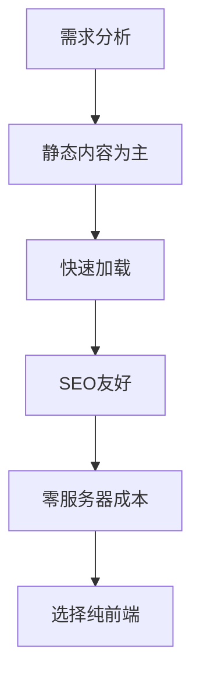
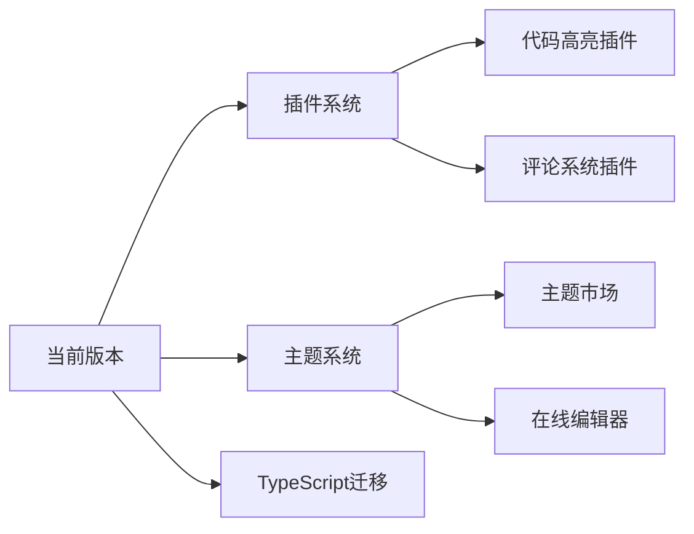

# 从零搭建静态博客：现代前端工程化实践与思考

> 最好的学习方式是创造，而创造的最佳起点是构建一个属于自己的数字花园。

## 引言：为什么要从零开始？

在众多优秀的静态站点生成器（如 Hexo、Hugo、Jekyll）存在的今天，为什么还要选择从零开始搭建博客？这个问题困扰了很多人，但对我来说，**学习过程本身就是最大的价值**。

### 传统工具 vs 自建系统

| 特性 | 传统静态站点生成器 | 自建系统 |
|------|-------------------|----------|
| **学习成本** | 低，快速上手 | 高，需要深入理解 |
| **灵活度** | 中等，受限于插件生态 | 极高，完全自主控制 |
| **技术深度** | 表层应用 | 底层原理到工程实践 |
| **可扩展性** | 依赖社区维护 | 按需扩展，无限制 |
| **部署复杂度** | 简化，一键部署 | 需要自行配置 |

**核心观点**：使用现成工具是**消费技术**，自建系统是**理解技术**。

## 一、技术栈选择与思考

### 1.1 为什么选择纯前端技术栈？



**决策依据**：
1. **内容性质**：博客以文字为主，交互需求简单
2. **性能要求**：静态文件可被CDN缓存，加载极快
3. **成本考量**：GitHub Pages 提供免费托管
4. **维护成本**：无需服务器运维，专注内容创作

### 1.2 核心工具链

```javascript
// package.json 中的关键依赖
{
  "devDependencies": {
    // 构建工具
    "fs-extra": "^11.0.0",      // 增强的文件操作
    "marked": "^12.0.0",        // Markdown 解析
    "gray-matter": "^4.0.3",    // Front Matter 解析
    
    // 开发工具
    "nodemon": "^3.0.0",        // 文件监听
    "live-server": "^1.2.0",    // 本地开发服务器
    
    // 代码质量
    "prettier": "^3.0.0",       // 代码格式化
    "eslint": "^8.0.0"          // 代码检查
  }
}
```

**选择理由**：
- **fs-extra**：Node.js 原生 fs 模块的增强版，提供 Promise 支持
- **marked**：轻量级、高性能的 Markdown 解析器
- **gray-matter**：优雅地解析 YAML Front Matter
- **nodemon**：开发时自动重启，提升开发体验

## 二、架构设计与模块化

### 2.1 项目结构设计

```
my-blog/
├── src/                    # 源码目录
│   ├── data/              # 内容数据
│   │   ├── articles/      # Markdown 文章
│   │   ├── projects/      # 项目数据
│   │   └── config.json    # 站点配置
│   ├── templates/         # HTML 模板
│   │   ├── base.html      # 基础布局
│   │   └── article.html   # 文章模板
│   └── assets/           # 静态资源
│       ├── css/
│       ├── js/
│       └── images/
├── scripts/               # 构建脚本
│   └── builder.js        # 静态站点生成器
└── public/               # 构建输出
```

**设计理念**：**关注点分离**（Separation of Concerns）
- 数据与表现分离
- 模板与逻辑分离
- 开发与生产分离

### 2.2 构建系统设计

```javascript
// builder.js 的核心架构
class SiteBuilder {
  constructor() {
    this.pipeline = [
      this.cleanOutput.bind(this),
      this.loadConfig.bind(this),
      this.processContent.bind(this),
      this.generatePages.bind(this),
      this.optimizeAssets.bind(this)
    ];
  }
  
  async build() {
    for (const step of this.pipeline) {
      await step();
    }
  }
}
```

**构建流程**：
1. **清理阶段**：删除旧的构建文件
2. **读取阶段**：加载配置和内容
3. **转换阶段**：Markdown → HTML，模板渲染
4. **生成阶段**：输出静态文件
5. **优化阶段**：压缩、合并、添加哈希

## 三、Markdown 处理与扩展

### 3.1 Front Matter 设计

```yaml
---
title: "文章标题"
date: 2025-01-28
tags: ["标签1", "标签2"]
category: "分类"
summary: "文章摘要"
read_time: 10
difficulty: "进阶"
cover_image: "/assets/cover.jpg"
---
```

**元数据作用**：
- **SEO优化**：title, description, keywords
- **内容组织**：tags, category
- **用户体验**：read_time, difficulty
- **视觉呈现**：cover_image

### 3.2 Markdown 扩展功能

```javascript
// 自定义 Markdown 渲染器
const renderer = new marked.Renderer();

// 1. 标题锚点
renderer.heading = function(text, level) {
  const escapedText = text.toLowerCase().replace(/[^\w]+/g, '-');
  return `<h${level} id="${escapedText}">${text}</h${level}>`;
};

// 2. 代码块增强
renderer.code = function(code, language) {
  const highlighted = hljs.highlight(code, { language }).value;
  return `
    <div class="code-block">
      <div class="code-header">
        <span class="language">${language}</span>
        <button class="copy-btn">复制</button>
      </div>
      <pre><code class="hljs ${language}">${highlighted}</code></pre>
    </div>
  `;
};
```

## 四、模板引擎与组件化

### 4.1 简单的模板引擎实现

```javascript
// 简易模板引擎
class TemplateEngine {
  constructor(template, data) {
    this.template = template;
    this.data = data;
  }
  
  render() {
    return this.template.replace(/\{\{(\w+)\}\}/g, (match, key) => {
      return this.data[key] || '';
    });
  }
}

// 使用示例
const template = '<h1>{{title}}</h1><p>{{content}}</p>';
const data = { title: 'Hello', content: 'World' };
const engine = new TemplateEngine(template, data);
console.log(engine.render()); // <h1>Hello</h1><p>World</p>
```

### 4.2 组件化设计

```html
<!-- 文章卡片组件 -->
<article class="article-card" data-id="{{id}}">
  <div class="card-header">
    <div class="category">{{category}}</div>
    <h3 class="title">{{title}}</h3>
    <p class="summary">{{summary}}</p>
  </div>
  <div class="card-footer">
    <div class="meta">
      <time>{{date}}</time>
      <span class="read-time">{{read_time}} min</span>
    </div>
    <div class="tags">
      {{#each tags}}
      <span class="tag">{{this}}</span>
      {{/each}}
    </div>
  </div>
</article>
```

## 五、性能优化策略

### 5.1 构建时优化

```javascript
// 图片优化示例
async function optimizeImages() {
  const images = await glob('src/assets/images/**/*.{jpg,png,webp}');
  
  for (const image of images) {
    // 1. 压缩图片
    await sharp(image)
      .resize(1200) // 限制最大宽度
      .webp({ quality: 80 }) // 转换为 WebP
      .toFile(image.replace(/\.(jpg|png)$/, '.webp'));
    
    // 2. 生成不同尺寸
    await generateResponsiveImages(image);
  }
}
```

### 5.2 运行时优化

```css
/* 关键 CSS 内联 */
<style>
  /* 首屏关键样式 */
  .header, .hero, .first-article {
    /* 精简的初始样式 */
  }
</style>

<!-- 非关键 CSS 异步加载 -->
<link 
  rel="preload" 
  href="/assets/css/non-critical.css" 
  as="style" 
  onload="this.onload=null;this.rel='stylesheet'"
>
<noscript>
  <link rel="stylesheet" href="/assets/css/non-critical.css">
</noscript>
```

## 六、开发工作流优化

### 6.1 自动化脚本配置

```json
{
  "scripts": {
    "dev": "concurrently \"npm run build:watch\" \"npm run serve\"",
    "build": "NODE_ENV=production node scripts/builder.js",
    "build:watch": "nodemon --watch src --ext md,html,json --exec \"npm run build\"",
    "serve": "live-server public --port=3000 --watch=public",
    "deploy": "npm run build && gh-pages -d public",
    "format": "prettier --write \"src/**/*.{js,md,css,html}\"",
    "lint": "eslint src/scripts/**/*.js"
  }
}
```

### 6.2 Git Hooks 集成

```json
{
  "husky": {
    "hooks": {
      "pre-commit": "npm run lint && npm run format",
      "pre-push": "npm run build"
    }
  }
}
```

## 七、部署与持续集成

### 7.1 GitHub Actions 自动化部署

```yaml
# .github/workflows/deploy.yml
name: Deploy to GitHub Pages

on:
  push:
    branches: [ main ]
  pull_request:
    branches: [ main ]

jobs:
  build-and-deploy:
    runs-on: ubuntu-latest
    steps:
      - uses: actions/checkout@v3
      
      - name: Setup Node.js
        uses: actions/setup-node@v3
        with:
          node-version: '18'
          cache: 'npm'
      
      - name: Install dependencies
        run: npm ci
      
      - name: Build
        run: npm run build
      
      - name: Deploy
        uses: peaceiris/actions-gh-pages@v3
        with:
          github_token: ${{ secrets.GITHUB_TOKEN }}
          publish_dir: ./public
```

## 八、遇到的挑战与解决方案

### 8.1 跨平台路径问题

**问题**：Windows 和 Unix 系统的路径分隔符不同
```javascript
// ❌ 错误写法
const path = 'src/data/articles';

// ✅ 正确写法
const path = path.join('src', 'data', 'articles');
```

### 8.2 相对路径处理

**问题**：文章中的图片引用路径需要转换
```javascript
function processImagePaths(content, slug) {
  // 将相对路径转换为绝对路径
  return content.replace(
    /!\[([^\]]*)\]\(([^)]+)\)/g,
    (match, alt, src) => {
      if (!src.startsWith('http')) {
        src = `/assets/images/${slug}/${src}`;
      }
      return `!${src}`;
    }
  );
}
```

### 8.3 增量构建优化

**问题**：每次构建都处理所有文件，效率低下
```javascript
// 文件哈希缓存
class BuildCache {
  constructor() {
    this.cacheFile = '.build-cache.json';
  }
  
  async getFileHash(filePath) {
    const content = await fs.readFile(filePath);
    return createHash('md5').update(content).digest('hex');
  }
  
  async hasChanged(filePath) {
    const currentHash = await this.getFileHash(filePath);
    const cache = await this.loadCache();
    return cache[filePath] !== currentHash;
  }
}
```

## 九、技术收获与反思

### 9.1 技术层面的提升

1. **Node.js 文件系统操作**：深入理解了异步文件处理
2. **构建工具原理**：理解了 Webpack、Vite 等工具的基本思想
3. **模块化设计**：学会了如何设计可维护的代码结构
4. **性能优化**：掌握了前端性能优化的多种策略

### 9.2 工程思维的形成

1. **迭代开发**：从简单到复杂，逐步添加功能
2. **错误处理**：学会了防御性编程和错误边界处理
3. **文档意识**：代码注释、README、技术文档的撰写
4. **版本控制**：合理的 Git 提交策略和分支管理

### 9.3 可改进的方向



## 十、给后来者的建议

### 10.1 学习路径建议

1. **阶段一：基础功能**
   - Markdown 解析
   - 简单模板渲染
   - 基础样式设计

2. **阶段二：增强功能**
   - 代码高亮
   - 图片优化
   - RSS 生成

3. **阶段三：工程优化**
   - 构建缓存
   - 增量更新
   - 错误监控

### 10.2 技术选型建议

```javascript
// 根据需求选择技术栈
const techStack = {
  beginner: {
    // 快速上手
    builder: 'hexo',
    hosting: 'vercel',
    cms: 'forestry'
  },
  intermediate: {
    // 平衡学习与效率
    builder: '自建 + 模板引擎',
    hosting: 'github-pages',
    cms: '自建后台'
  },
  advanced: {
    // 完全控制
    builder: '自建构建系统',
    hosting: '自建服务器',
    cms: 'headless-cms'
  }
};
```

### 10.3 避免的坑

1. **不要过度设计**：从 MVP（最小可行产品）开始
2. **不要忽略文档**：每个功能都要有文档记录
3. **不要闭门造车**：参考优秀开源项目的设计
4. **不要忽视测试**：至少要有基础的单元测试

## 结语

从零开始搭建博客系统，不仅仅是为了拥有一个博客，更重要的是：

1. **理解技术本质**：从使用工具到理解工具
2. **培养工程思维**：从写代码到构建系统
3. **记录成长轨迹**：从学习到创造的过程本身就是最好的内容
4. **建立技术自信**：能够独立完成一个完整的项目

> 技术的价值不在于你使用了多高级的工具，而在于你用它创造了什么。

---

## 项目资源

- **源码仓库**：https://github.com/MingShuo-S/MingShuo-S.github.io
- **在线演示**：https://mingshuo-s.github.io
- **技术文档**：https://github.com/MingShuo-S/MingShuo-S.github.io/wiki

## 扩展阅读

1. https://www.netlify.com/blog/2020/04/14/what-is-a-static-site-generator-and-3-ways-to-find-the-best-one/
2. https://frontendmasters.com/books/front-end-handbook/2019/4-tools/
3. http://aosabook.org/en/

---

**版权声明**：本文为个人技术实践记录，遵循 CC BY-NC-SA 4.0 协议。欢迎分享，但需保留原文链接。

**最后更新**：2026年3月12日  
**作者**：阳光
**分类**：技术实践 / 前端工程 / 个人项目